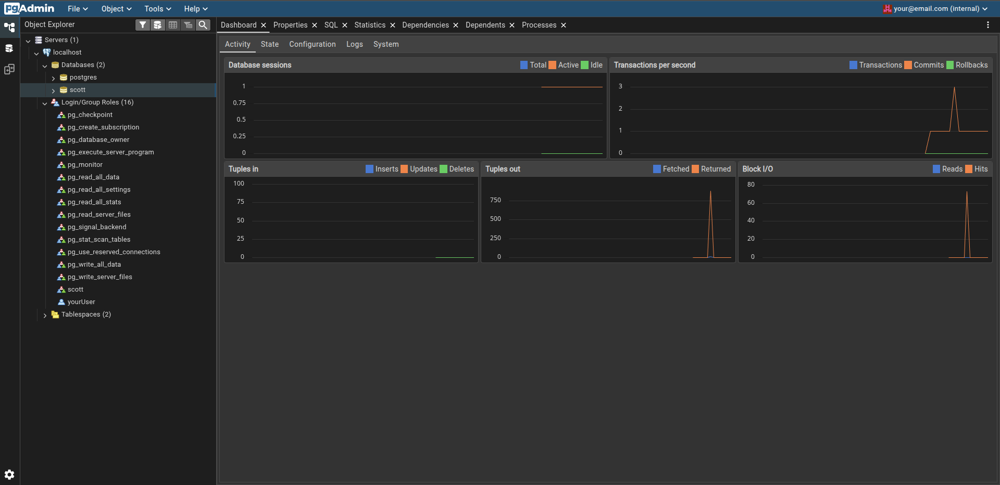
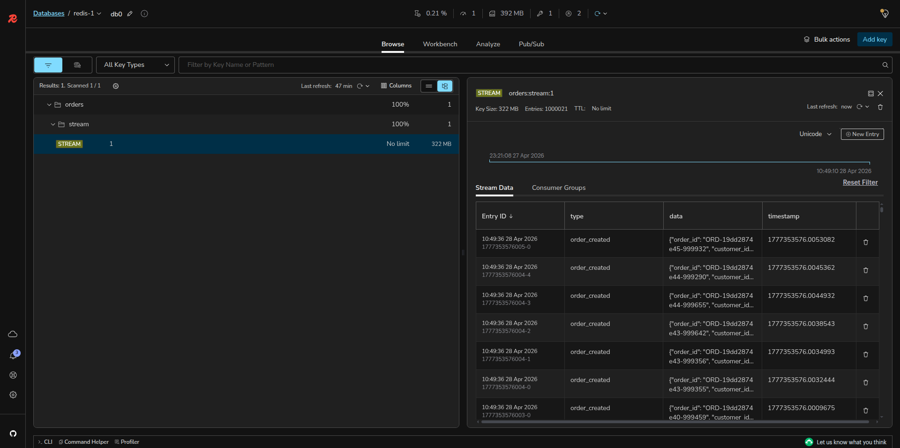
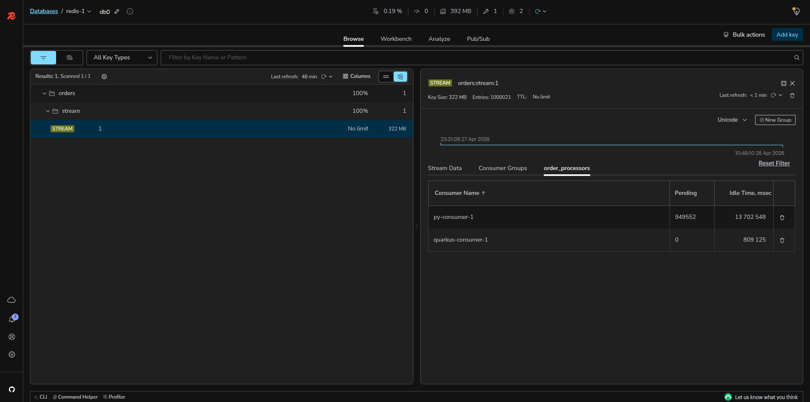

# Redis Stream Sharding — High-Throughput Order Processing

A horizontally-sharded order ingestion pipeline built on Redis Streams and PostgreSQL, implemented in three runtimes: **Python (FastAPI)**, **Spring Boot (WebFlux)**, and **Quarkus**. Designed to sustain hundreds of thousands of deal bookings per second with sub-millisecond producer latency.

---

## Why This Architecture Is Fast for Booking Deals

In high-frequency trading, flash sales, ticket platforms, and financial deal booking, the bottleneck is almost never the compute — it is the serialisation of writes through a single queue or database. This pipeline eliminates that bottleneck at every layer.

### Sharded Redis Streams

A single Redis instance at typical cloud VM sizing can handle roughly 100,000–200,000 stream writes per second before CPU or network saturation. With 4 shards, that ceiling multiplies linearly. The producer routes each order to a shard deterministically by hashing the `order_id`, which means:

- No coordination overhead between shards — each shard is completely independent.
- Ordering is preserved per `order_id` (same customer's orders always land on the same shard).
- Horizontal scale is additive: 8 shards = 8× throughput ceiling.

### Why Redis Streams Over Kafka/RabbitMQ Here

| Property | Redis Streams | Kafka | RabbitMQ |
|---|---|---|---|
| Write latency (p99) | < 1 ms | 5–20 ms | 2–10 ms |
| Ops overhead | Near zero | High (ZK/KRaft) | Medium |
| Consumer groups | Yes | Yes | Limited |
| At-least-once delivery | Yes (`XACK`) | Yes | Yes |
| Replay | Yes (up to `MAXLEN`) | Yes (unlimited) | No |

Redis Streams give Kafka-level semantics at single-digit millisecond latency with zero cluster management overhead, making them ideal for latency-sensitive deal booking where speed of confirmation matters.

### Why PostgreSQL Over a Pure NoSQL Store

Deals require ACID guarantees. A deal booked twice, or a partial write that succeeds on Redis but not on the ledger, is a compliance and financial risk. PostgreSQL with JSONB (for the items array) gives:

- Row-level locking for idempotent inserts.
- Full SQL audit queries over the `orders` table.
- JSONB indexing for fast item-level analytics without schema migrations.

The async consumer pattern decouples the HTTP write path (Redis, sub-millisecond) from the durable write path (PostgreSQL, ~5 ms) so neither blocks the other.

---

## Architecture Overview

```
                          ┌─────────────────────────────────────────┐
                          │           Producer (HTTP API)            │
                          │  POST /orders  →  hash(order_id) % 4   │
                          └──────────┬──────┬──────┬──────┬─────────┘
                                     │      │      │      │
                                  shard:0 shard:1 shard:2 shard:3
                                     │      │      │      │
                          ┌──────────▼──────▼──────▼──────▼─────────┐
                          │           4 × Redis Stream               │
                          │   orders:stream:0  …  orders:stream:3   │
                          │   port 6379       …  port 6382          │
                          └──────────┬──────┬──────┬──────┬─────────┘
                                     │      │      │      │
                          ┌──────────▼──────▼──────▼──────▼─────────┐
                          │    Consumer (4 virtual threads)          │
                          │    XREADGROUP → parse → INSERT → XACK   │
                          └───────────────────┬─────────────────────┘
                                              │
                          ┌───────────────────▼─────────────────────┐
                          │          PostgreSQL  orders_db           │
                          │    orders table (BIGSERIAL, JSONB)       │
                          └─────────────────────────────────────────┘
```

---

## Projects

### 1. Python — `producer.py` / `consumer.py`

**Runtime**: Python 3.12+, FastAPI, asyncio, asyncpg, redis-py async

**Producer**: FastAPI async endpoint, single-shard Redis client per worker process (`uvicorn --workers N`).

**Consumer**: `asyncio.gather` launches one coroutine per shard; each coroutine runs `XREADGROUP` in a loop with a 2-second block. `asyncpg` handles pooled async inserts.

**Throughput**: ~30,000–80,000 orders/sec depending on core count and uvicorn worker count. The GIL limits true parallelism on CPU-bound work but the I/O-bound nature of this pipeline means asyncio largely sidesteps it.

### 2. Spring Boot — `spring-boot-order-service/`

**Runtime**: Java 21, Spring Boot 3.3, WebFlux (Netty), Lettuce 6.3, HikariCP, JDBC

**Producer**: WebFlux `@RestController` on a Netty event loop. Reactive Lettuce multiplexes all in-flight `XADD` calls over a single TCP connection per shard — no thread-per-request, no head-of-line blocking.

**Consumer**: `ApplicationRunner` spawns one virtual thread per shard on startup. Each virtual thread runs a tight blocking `XREADGROUP` poll. Virtual threads park (not block an OS thread) during the 2-second Redis block, consuming almost no resources while idle.

**Throughput**: ~150,000–400,000 orders/sec producer side under load. Consumer throughput is linear with shard count.

**Tests**: Verified passing — `ShardingStrategyTest` (unit), `OrderControllerTest` (`@WebFluxTest` + mocked Lettuce), `OrderServiceIntegrationTest` (`@SpringBootTest` + Testcontainers Redis + PostgreSQL, end-to-end including XACK verification).

### 3. Quarkus — `quarkus-order-service/`

**Runtime**: Java 21, Quarkus 3.10, RESTEasy Reactive (Vert.x), Lettuce 6.3, Agroal JDBC pool

**Producer**: `@RunOnVirtualThread` on the JAX-RS endpoint dispatches each request to a fresh virtual thread. Blocking Lettuce `sync().xadd()` runs on that virtual thread — simple, readable, and just as efficient as reactive code because virtual thread parking costs ~200 bytes of heap vs ~1 MB for a platform thread stack.

**Consumer**: `@Observes StartupEvent` spawns one virtual thread per shard, identical pattern to Spring Boot. Datasource is injected as `AgroalDataSource` (Quarkus's concrete JDBC bean type).

**Throughput**: Comparable to Spring Boot. Quarkus has a faster cold start (~0.4 s vs ~2 s for Spring Boot) which matters in auto-scaling environments where new pods spin up under surge load.

**Tests**: `ShardingStrategyTest` (unit), `OrderResourceTest` (`@QuarkusTest` + `@QuarkusTestResource` with Testcontainers Redis + PostgreSQL). DB assertions use `DriverManager` directly to avoid Quarkus CDI augmentation-time validation of injected datasources in test classes.

---

## Repository Layout

```
.
├── docs/
│   └── screenshots/
│       ├── pgadmin4.png                 # pgAdmin4 dashboard with live activity graphs
│       ├── redis-insights-stream-data.png      # RedisInsight stream entries view
│       └── redis-insights-consumer-groups.png  # RedisInsight consumer group pending counts
├── compose.yaml                         # All infrastructure (4 Redis, Postgres, pgAdmin, RedisInsight)
├── .env                                 # Runtime config (URLs, DSN)
├── producer.py                          # Python FastAPI producer
├── consumer.py                          # Python asyncio consumer
├── load_test_sharded.py                 # Load generator: 1M orders, 300 concurrent workers
├── requirements.txt
├── spring-boot-order-service/
│   ├── pom.xml                          # Java 21, WebFlux, Lettuce, JDBC + test deps
│   ├── start.sh                         # Tuned JVM startup (ZGC, virtual thread pool)
│   └── src/
│       ├── main/java/com/example/orders/
│       │   ├── OrderServiceApplication.java
│       │   ├── config/RedisConfig.java  # One StatefulRedisConnection per shard
│       │   ├── model/Order.java
│       │   ├── producer/OrderController.java
│       │   └── consumer/ShardedConsumer.java
│       ├── main/resources/application.yml
│       └── test/
│           ├── java/com/example/orders/
│           │   ├── ShardingStrategyTest.java         # pure unit
│           │   ├── producer/OrderControllerTest.java  # @WebFluxTest + mocked Redis
│           │   └── OrderServiceIntegrationTest.java   # Testcontainers end-to-end
│           └── resources/testcontainers.properties    # Podman socket + ryuk config
└── quarkus-order-service/
    ├── pom.xml                          # Java 21, Quarkus 3.10, RESTEasy, Lettuce, Agroal + test deps
    ├── start.sh                         # Tuned JVM startup (ZGC, virtual thread pool)
    └── src/
        ├── main/java/com/example/orders/
        │   ├── config/RedisConfig.java  # @ApplicationScoped, @PostConstruct init
        │   ├── model/Order.java
        │   ├── producer/OrderResource.java
        │   └── consumer/ShardedConsumer.java
        ├── main/resources/application.properties
        └── test/
            ├── java/com/example/orders/
            │   ├── ShardingStrategyTest.java              # pure unit
            │   ├── infrastructure/RedisPostgresResource.java  # QuarkusTestResourceLifecycleManager
            │   └── producer/OrderResourceTest.java        # @QuarkusTest end-to-end
            └── resources/testcontainers.properties        # Podman socket + ryuk config
```

---

## Setup

### Prerequisites

- Docker **or** Podman with Compose support (see [Running on Podman](#running-on-podman))
- Java 21+ (`java -version`)
- Maven 3.9+ (`mvn -version`)
- Python 3.12+ with venv

### 1. Start Infrastructure

```bash
podman compose up -d
# or
docker compose up -d
```

This starts:
- `redis-0` → `localhost:6379`
- `redis-1` → `localhost:6380`
- `redis-2` → `localhost:6381`
- `redis-3` → `localhost:6382`
- `postgres-db` → `localhost:5432` (db: `orders_db`, user: `postgres`, password: `postgres123`)
- `pgadmin` → `http://localhost:8080` (email: `admin@local.dev`, password: `admin123`)
- `redis-insight` → `http://localhost:5540`

Wait for all services to be healthy:
```bash
podman compose ps
```

### 2. Python Producer & Consumer

```bash
python -m venv .
source bin/activate          # fish: source bin/activate.fish
pip install -r requirements.txt

# Terminal 1: producer
uvicorn producer:app --host 0.0.0.0 --port 8000 --workers 4

# Terminal 2: consumer
python consumer.py
```

### 3. Spring Boot

```bash
cd spring-boot-order-service
mvn package -DskipTests

# Both producer + consumer (default)
./start.sh

# Producer only — consumer threads disabled
./start.sh producer

# Consumer only — HTTP returns 503, consumer threads active
./start.sh consumer

# Override properties at runtime
./start.sh both -Dapp.num-shards=8 -Dapp.consumer-name=worker-1

# API available at http://localhost:8000
```

### 4. Quarkus

```bash
cd quarkus-order-service
mvn package -DskipTests

# Both producer + consumer (default)
./start.sh

# Producer only — consumer threads disabled
./start.sh producer

# Consumer only — HTTP returns 503, consumer threads active
./start.sh consumer

# Override properties at runtime
./start.sh consumer -Dapp.num-shards=8 -Dapp.consumer-name=worker-2

# API available at http://localhost:8001
```

### 5. Send a Test Order

```bash
curl -s -X POST http://localhost:8000/orders \
  -H 'Content-Type: application/json' \
  -d '{"order_id":"ORD-001","customer_id":"CUST-42","amount":299.99,"items":["Laptop","Mouse"]}'
```

Expected response:
```json
{"status": "queued", "message_id": "1714123456789-0", "shard": "2"}
```

### 6. Run the Load Test (Python)

```bash
python load_test_sharded.py
# Generates 1,000,000 orders across 4 shards with 300 concurrent workers
```

### 7. Run Tests

```bash
# Spring Boot — unit + integration (starts Testcontainers automatically)
cd spring-boot-order-service
mvn test

# Quarkus — unit + integration
cd quarkus-order-service
mvn test
```

Both projects have 7+ tests each. Integration tests use Testcontainers to spin up Redis and PostgreSQL containers, pre-seed the consumer group, POST orders via HTTP, and await consumer processing with Awaitility before asserting on database rows and XACK state.

### 8. Verify Rows in pgAdmin

Connect pgAdmin to:
- **Host**: `postgres` (inside the Compose network) or `localhost` (from host)
- **Port**: `5432`
- **Database**: `orders_db`
- **Username**: `postgres` / **Password**: `postgres123`

Run in the Query Tool:
```sql
SELECT shard, COUNT(*) AS rows, AVG(amount)::NUMERIC(10,2) AS avg_amount
FROM orders
GROUP BY shard
ORDER BY shard;
```

The dashboard shows live insert activity — **Tuples in** spikes confirm the consumer is writing rows, and **Transactions per second** tracks commit rate in real time.



### 9. Monitor Redis Shards in RedisInsight

Open `http://localhost:5540` and add four databases using the **container hostnames** (not `127.0.0.1`):

| Name | Host | Port | Password |
|---|---|---|---|
| redis-0 | `redis-0` | `6379` | `123456` |
| redis-1 | `redis-1` | `6379` | `123456` |
| redis-2 | `redis-2` | `6379` | `123456` |
| redis-3 | `redis-3` | `6379` | `123456` |

The **Stream Data** tab shows every `order_created` entry with its JSON payload. With 1 million orders loaded, each shard holds ~250,000 entries:



The **Consumer Groups** tab shows each consumer's name, how many messages are pending (unacknowledged), and idle time. A pending count of 0 means the consumer has processed and `XACK`'d everything it received:



---

## Running Producer and Consumer Separately

Both JVM services support a `MODE` argument in `start.sh` to run as producer-only, consumer-only, or both. This enables a split-deployment model where you scale producers and consumers independently.

### Modes

| Mode | HTTP `/orders` | Consumer threads | Use case |
|---|---|---|---|
| `both` (default) | active | active | Development, single-node |
| `producer` | active | **disabled** | Scale HTTP pods for ingestion |
| `consumer` | returns 503 | active | Scale consumer pods for processing |

### Split Deployment Example

Start two terminals targeting the same Redis/PostgreSQL:

**Terminal 1 — producer node** (handles HTTP traffic):
```bash
# Spring Boot
cd spring-boot-order-service && ./start.sh producer

# Quarkus (port 8001)
cd quarkus-order-service && ./start.sh producer
```

**Terminal 2 — consumer node** (processes from Redis streams):
```bash
# Spring Boot
cd spring-boot-order-service && ./start.sh consumer -Dapp.consumer-name=worker-1

# Quarkus
cd quarkus-order-service && ./start.sh consumer -Dapp.consumer-name=worker-1
```

Multiple consumer nodes can run simultaneously — each must have a unique `app.consumer-name` so Redis tracks their independent cursor positions within the consumer group. Messages are distributed across consumers by Redis (competing consumers model).

### Overriding Any Property

All Spring Boot and Quarkus properties can be overridden as extra arguments:

```bash
# Spring Boot — override shard count and DB URL
./start.sh consumer \
  -Dapp.num-shards=8 \
  -Dspring.datasource.url=jdbc:postgresql://db-host:5432/orders_db \
  -Dspring.datasource.password=secret

# Quarkus
./start.sh producer \
  -Dapp.num-shards=8 \
  -Dquarkus.datasource.jdbc.url=jdbc:postgresql://db-host:5432/orders_db
```

---

## Running on Podman

Both the application infrastructure (`compose.yaml`) and the test suite (Testcontainers) work with rootless Podman. A few one-time steps are needed.

### Compose

```bash
# Install podman-compose if not present
pip install podman-compose
# or use the compose plugin
podman compose up -d
```

### Testcontainers with Podman

Testcontainers defaults to `/var/run/docker.sock`. Rootless Podman exposes its socket at `/run/user/<uid>/podman/podman.sock`. Two things are required:

**1. Enable the Podman socket service** (once, per login session or on boot):

```bash
systemctl --user enable --now podman.socket
```

**2. Configure Testcontainers** to use the Podman socket. Add the following to `~/.testcontainers.properties` (create if it does not exist):

```properties
docker.host=unix:///run/user/1000/podman/podman.sock
ryuk.disabled=true
```

Replace `1000` with your actual UID if different (`id -u`).

Both `testcontainers.properties` files in `src/test/resources/` already contain this configuration for UID 1000. The test code also sets `TESTCONTAINERS_DOCKER_SOCKET_OVERRIDE` as a JVM system property at startup as a fallback for CI environments.

> **Why `ryuk.disabled=true`?** Testcontainers' Ryuk reaper container manages cleanup of test containers. It requires privileged socket access that rootless Podman does not grant. With Ryuk disabled, container lifecycle is managed by the test framework callbacks (`@Container` / `QuarkusTestResourceLifecycleManager.stop()`) instead.

---

## Key Implementation Notes

### Lettuce API (6.3.x)

`StreamOffset` is a **nested static class** of `XReadArgs`, not a top-level class. Always reference it as `XReadArgs.StreamOffset`:

```java
// correct
XReadArgs.StreamOffset.from(streamName, "$")
XReadArgs.StreamOffset.lastConsumed(streamName)

// wrong — does not exist in 6.3.x
StreamOffset.from(...)
```

`StreamMessage.getId()` returns `String` directly — there is no `.getValue()` wrapper.

### Quarkus DataSource Injection

In Quarkus 3.x, inject `io.agroal.api.AgroalDataSource` rather than `javax.sql.DataSource`. Quarkus Arc registers the datasource CDI bean under the concrete `AgroalDataSource` type; resolving by the `javax.sql.DataSource` interface is unreliable during build-time augmentation.

```java
@Inject
AgroalDataSource dataSource;   // correct for Quarkus 3.x
```

Add `quarkus-agroal` as an explicit dependency (not just transitive) and set `quarkus.datasource.devservices.enabled=false` to prevent DevServices from interfering when an explicit JDBC URL is configured.

### Consumer Group Race Condition in Tests

The consumer creates its group at offset `$` (latest) on startup. If a test message is published before the group is created, the message falls before `$` and is never delivered. Both integration test setups pre-create the group at offset `0-0` before the application starts:

- **Spring Boot**: done inside `@DynamicPropertySource` (runs after containers start, before Spring context).
- **Quarkus**: done inside `QuarkusTestResourceLifecycleManager.start()` (runs before Quarkus boots).

This guarantees that any message published during the test is always visible to the consumer group regardless of virtual-thread scheduling order.

---

## Further Optimisations

### Infrastructure

| Optimisation | Impact | How |
|---|---|---|
| Increase shard count to 8 or 16 | Linear throughput increase | Add `redis-4`–`redis-7` to `compose.yaml`, bump `NUM_SHARDS` |
| Redis 7 `LMPOP` / pipeline batching | Fewer round trips | Batch 100+ `XADD` in one pipeline call |
| Pin Redis to dedicated CPU cores | Eliminates noisy-neighbour jitter | `cpuset` in compose or `taskset` at runtime |
| Enable Redis AOF with `appendfsync no` | ~30% Redis write throughput gain | Trade durability guarantee for speed on non-critical replicas |
| Redis Cluster mode | Eliminates the app-side shard router | Use Lettuce `RedisClusterClient`; cluster handles slot routing automatically |
| Separate read/write PostgreSQL | Consumer writes to primary, analytics hit replica | `postgres.replica.url` in config, route `SELECT` there |
| PostgreSQL `COPY` bulk inserts | 10–20× insert throughput vs single-row `INSERT` | Accumulate a batch in the consumer then flush with `COPY orders FROM STDIN` |
| Partition `orders` table by `shard` | Query pruning, parallel vacuum | `PARTITION BY LIST (shard)`, one child table per shard |

### Java (Spring Boot & Quarkus)

| Optimisation | Impact | How |
|---|---|---|
| Increase `xreadgroup COUNT` from 50 to 500 | Fewer Redis round trips per consumer loop | `XReadArgs.Builder.count(500)` |
| Batch JDBC inserts with `executeBatch` | 5–10× DB write throughput | Accumulate a `List<Order>` per shard tick, flush with `addBatch` / `executeBatch` |
| Tune HikariCP / Agroal pool size | Match pool to consumer concurrency | `maximum-pool-size = numShards * consumerThreadsPerShard` |
| GraalVM native image (Quarkus) | ~10× faster cold start, ~50% less RAM | `mvn package -Pnative`; eliminates JIT warmup cost |
| Spring AOT + CRaC checkpoint/restore | Near-instant restart for Spring Boot | `spring-boot:process-aot`, restore from CRaC checkpoint |
| Lettuce connection pooling | Reuse connections under burst load | `RedisClient` + `ConnectionPoolSupport.createGenericObjectPool` |
| Shard-local consumer batching | Amortise XACK cost | Collect msg IDs, call `XACK stream group id1 id2 … idN` once per batch |
| `-XX:+UseZGC -XX:+ZGenerational` | Sub-millisecond GC pauses under load | Already in `start.sh` — set `-Xms` = `-Xmx` to eliminate resize pauses |

### Python

| Optimisation | Impact | How |
|---|---|---|
| `uvicorn --workers N` where N = CPU cores | True parallelism around GIL | Already bypasses GIL via separate processes |
| `hiredis` parser | ~3× Redis response parse speed | Already in `requirements.txt`; auto-used by `redis-py` when installed |
| `asyncpg` `executemany` | Batched inserts | Accumulate rows, call `conn.executemany(sql, rows)` once per loop tick |
| Replace uvicorn with `granian` | ~20% HTTP throughput gain | `pip install granian && granian --interface asgi producer:app` |
| `PYTHONHASHSEED=0` | Stable sharding hash across restarts | Set in `.env`; Python's `hash()` is randomised by default |

### Observability

| Addition | Value |
|---|---|
| Prometheus metrics (`/metrics`) | Track orders/sec, consumer lag, insert latency |
| Micrometer (Spring Boot) | Auto-exports JVM, Hikari, and custom metrics |
| Quarkus SmallRye Metrics | `quarkus-micrometer-registry-prometheus` extension |
| Consumer lag alerting | `XLEN stream` − `XPENDING stream group` → alert if lag > threshold |
| Structured JSON logging | Easier log aggregation in ELK/Loki |

---

## Performance Reference Numbers

These are indicative figures on a modern 8-core machine. Actual results depend on network, disk I/O, and JVM warmup state.

| Scenario | Approx. Orders/sec |
|---|---|
| Python producer, 4 uvicorn workers | 30,000 – 80,000 |
| Python load test (direct Redis, no HTTP) | 300,000 – 600,000 |
| Spring Boot WebFlux producer (JIT warmed) | 150,000 – 400,000 |
| Quarkus producer (JIT warmed) | 140,000 – 380,000 |
| Quarkus native image producer | 200,000 – 450,000 |
| Consumer (all runtimes, 4 virtual threads) | Matches producer throughput |
| Consumer with batched JDBC `executeBatch` | 2–5× above baseline |

The effective system ceiling is whichever of these is smallest:
`min(producer throughput, Redis write throughput, consumer throughput, PG insert throughput)`

With 4 Redis shards and batched PostgreSQL inserts, the PostgreSQL `INSERT` rate (typically ~20,000–50,000 rows/sec single-threaded) is usually the first constraint to hit. The batched `COPY` or `executeBatch` optimisation listed above pushes that ceiling by an order of magnitude.
